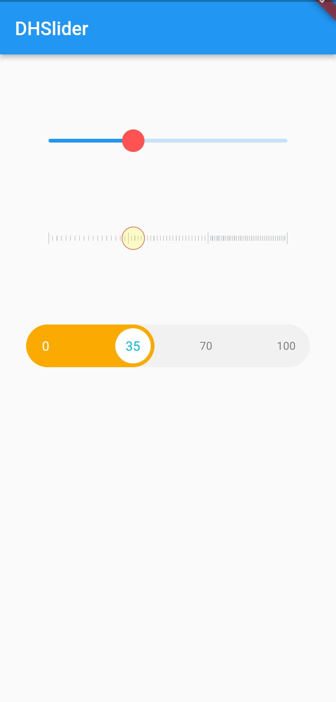

# dh_slider[](https://pub.dev/packages/dh_slider)

A handy slider that supports color and image settings for thumb and track.

Note that there is a [gesture problem](https://github.com/flutter/flutter/issues/28115?notification_referrer_id=MDE4Ok5vdGlmaWNhdGlvblRocmVhZDQ1MzM4MTIzMzoxMTg4MTc1MQ%3D%3D#issuecomment-674459890) when slider is used inside a scrollView, you need to set the `inScroll = true`.


## How to use

- Import dh_slider

```
import 'package:dh_slider/dh_slider.dart';
```

- Use color to set slider

```
DHSlider(
    inScroll: true,
    thumbBorderSide: BorderSide.none,
    thumbColor: Colors.redAccent,
    trackHeight: 3,
    margin: EdgeInsets.only(left: 10, right: 10, top: 20),
    value: slider,
    onChanged: (double value){
      this.setState(() {
        slider = value;
      });
    })
```

- Use image to set slider

```
FutureBuilder(
  future: sliderFuture,
  builder: (BuildContext context, AsyncSnapshot<ui.Image> snapshot) {
    return DHSlider(
      value: slider,
      trackImage: snapshot.data,
      trackHeight: 13,
      activeTrackColor: Colors.transparent,
      inactiveTrackColor: Colors.transparent,
      disabledActiveTrackColor: Colors.transparent,
      disabledInactiveTrackColor: Colors.transparent,
      thumbColor: Colors.white,
      disabledThumbColor: Colors.white,
      enabledThumbRadius: 12,
      margin: EdgeInsets.only(left: 10, right: 10, top: 30),
      thumbBorderSide: BorderSide(
        width: 0.6,
        color: Colors.red,
      ),
      onChanged: (value) {
        this.setState(() => slider = value);
      },
      min: 0,
      max: 1,
    );
  }
```

To use image settings for track and thumb, use `DHSlider.image`.


